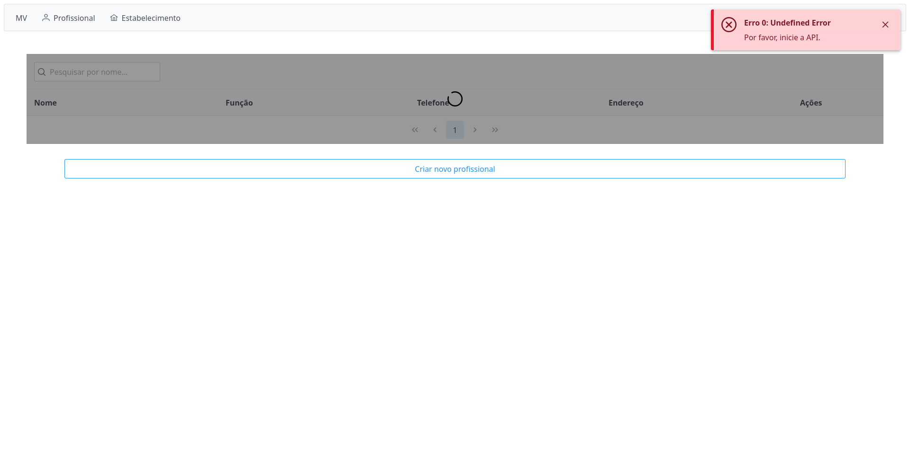
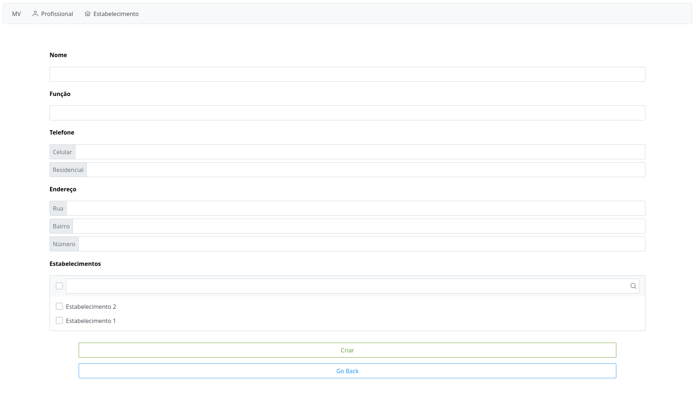
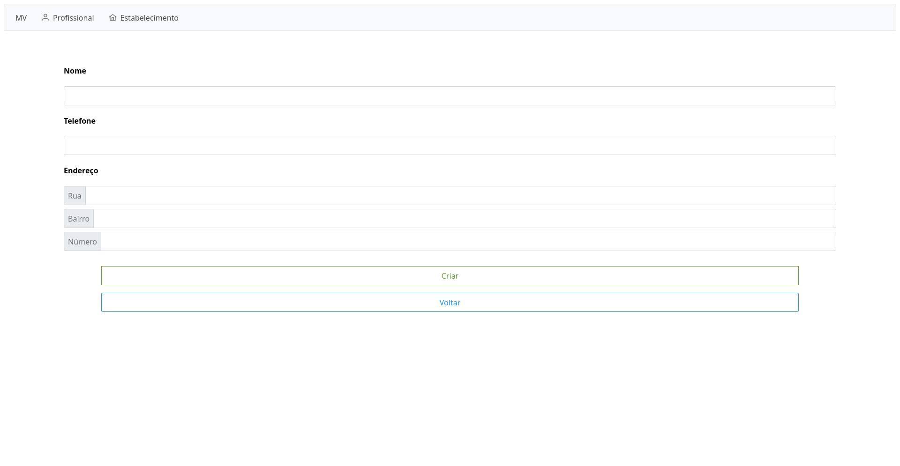
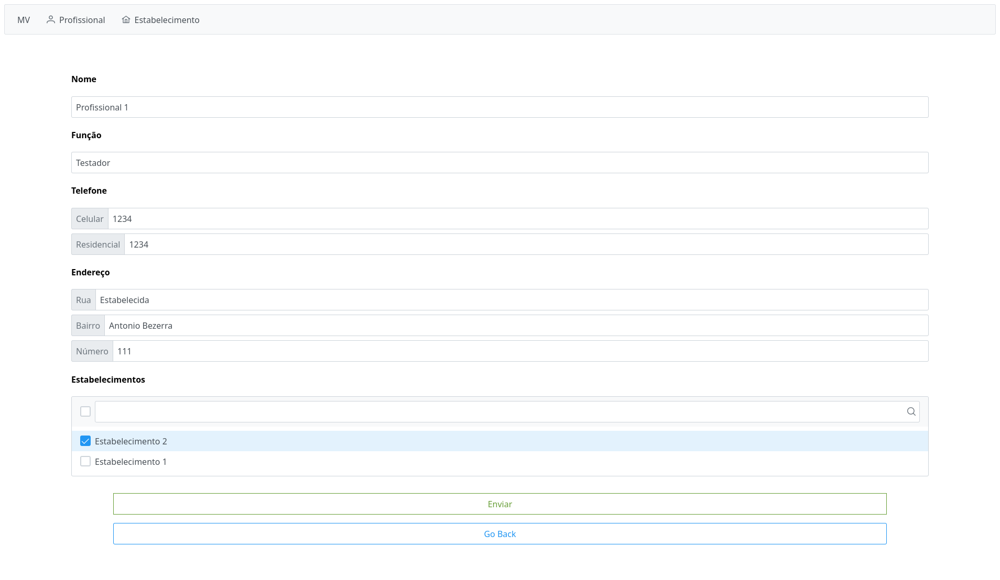
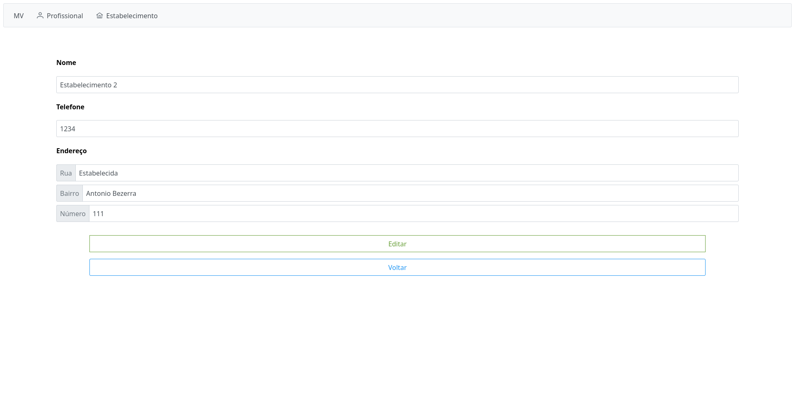
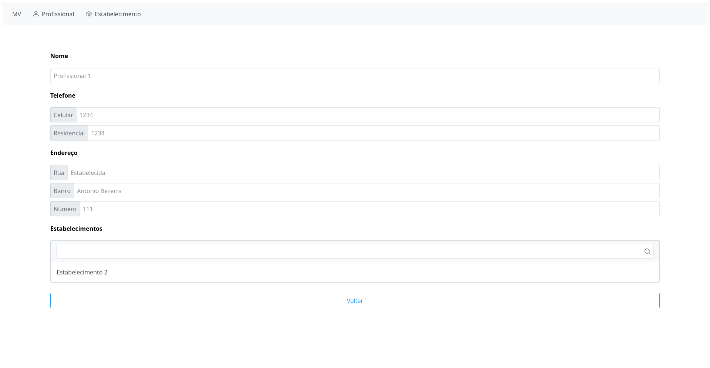
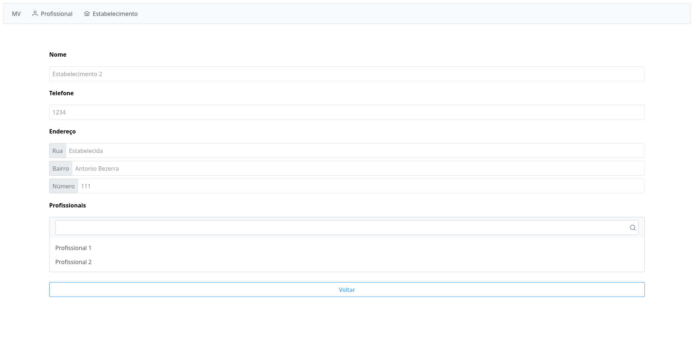

# `MV`

## Tecnologias usadas

- Angular com **PrimeNG**
- Spring Boot

## Back-end

O projeto foi feito tendo como foco maturidade nível 3 no [modelo de maturidade do Richardson](http://martinfowler.com/articles/richardsonMaturityModel.html). Embora ajude o `front-end`, usar HATEOAS pode aumentar a complexidade do projeto e este modelo não é usado como uma lista de demandas e sua utilidade depende de projeto para projeto.

### Endpoints

- `POST /api/v1/[recurso]`
- `GET /api/v1/[recurso]`
- `GET /api/v1/[recurso]/[id]`
- `DELETE /api/v1/[recurso]/[id]`
- `PUT /api/v1/[recurso]/[id]`

## Front-end

O front-end conta com `modals` de confirmação, `toasts` com notificações e erros, filtragem, etc.

### Rotas

- `/` (Dashboard)
- `/[recursos]` (Tabela)
- `/[recursos]/view/[id]` (Ver Um)
- `/[recursos]/edit/[id]` (Editar)
- `/[recursos]/new` (Criar)

## Imagens

_Erro 0_

_Criar profissional_

_Criar estabelecimento_

_Editar profissional_

_Editar estabelecimento_

_Ver profissional_

_Ver estabelecimento_
